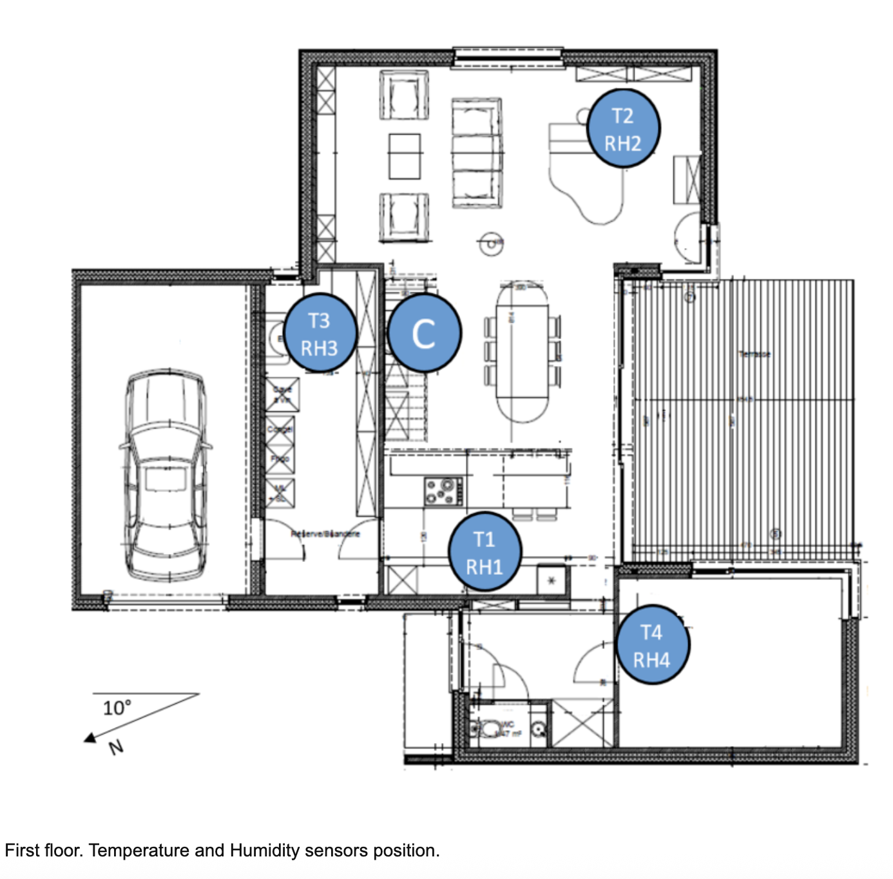
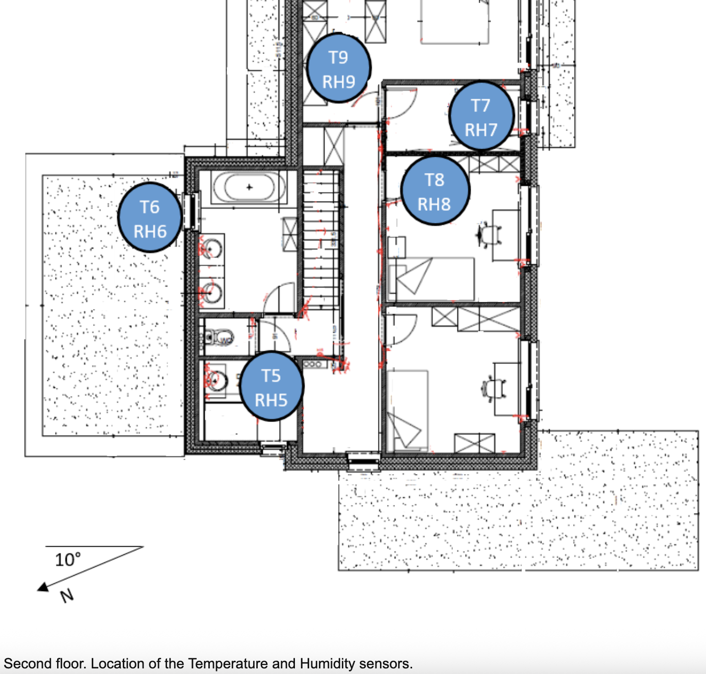

# ⚡ Monitoring Energy Consumption Trends for Homeowners

## 📌 Project Overview
This project helps homeowners **monitor energy consumption trends** and **predict future usage** using data-driven techniques. By combining:

- 🔍 Exploratory Data Analysis (EDA)  
- 📈 Trend Analysis  
- 🤖 Regression Modeling  

it delivers actionable insights to help reduce energy costs and environmental impact.

---

## ❗ Problem Statement
Providing real-time feedback on household energy use can reduce consumption by **5–15%** [2]. However, **tracking trends over time** unlocks even greater value:

- Detecting behavioral and seasonal changes  
- Identifying the impact of new appliances  
- Forecasting future energy costs  
- Setting and tracking energy-saving goals  

---

## 🎯 Objectives
- 📊 **Monitor Energy Trends**  
  Visualize consumption patterns and detect anomalies  

- 🔮 **Predict Future Usage**  
  Build regression models for energy forecasting  

- 💡 **Enable Optimization**  
  Identify key drivers of energy consumption  

---
## 📊 The Dataset

The dataset contains **time-series measurements** of energy consumption and environmental conditions collected from a low-energy smart home. **Dataset Source**: Published research paper [1]

---
#### ⏱️ Data Collection Overview

- Data was collected over **~4.5 months** at **10-minute intervals**  
- Indoor conditions were monitored using a **wireless sensor network**
  - Sensors recorded temperature and humidity every **~3.3 minutes**
  - Values were then **averaged over 10-minute periods**
- Energy consumption data was logged every **10 minutes** using **m-bus energy meters**
- **Weather data** was obtained from the **Chievres weather station** and merged using the timestamp (`date`)
- Two **random variables (`rv1`, `rv2`)** were included to test the models

---

#### 🧾 Feature Description

The dataset includes the following key variables:

- **`date`** → Timestamp of the observation  
- **`Appliances`** → Energy consumption of appliances (Wh) ⚡ *(target variable)*  
- **`lights`** → Energy consumption from lighting (Wh) 💡  

---

#### 🌡️ Temperature & Humidity Sensors

Temperature (`T`) and Relative Humidity (`RH`) readings were collected from different locations within the house:

| Feature | Description |
|--------|-------------|
| `T1`, `RH_1` | Temperature & humidity in **Kitchen area** |
| `T2`, `RH_2` | Temperature & humidity in **Living room area** |
| `T3`, `RH_3` | Temperature & humidity in **Laundry room area** |
| `T4`, `RH_4` | Temperature & humidity in **Office room** |
| `T5`, `RH_5` | Temperature & humidity in **Bathroom** |
| `T6`, `RH_6` | Temperature & humidity outside **the building (north side)** |
| `T7`, `RH_7` | Temperature & humidity in **Ironing room** |
| `T8`, `RH_8` | Temperature & humidity in **Teenager room 2** |
| `T9`, `RH_9` | Temperature & humidity in **Parents room** |

👉 In general:
- `T#` = Temperature (°C) in a specific room  
- `RH_#` = Relative Humidity (%) in the same room  

---

#### 🌍 Outdoor & Environmental Features

| Feature | Description |
|--------|-------------|
| `T_out` | Outdoor temperature from Chievres weather station (°C) |
| `RH_out` | Outdoor humidity from Chievres weather station (%) |
| `Press_mm_hg` | Atmospheric pressure from Chievres weather station (mm Hg) |
| `Windspeed` | Wind speed from Chievres weather station (m/s) |
| `Visibility` | Visibility from Chievres weather station (km) |
| `Tdewpoint` | Dew point temperature from Chievres weather station (°C) |

---

#### 🔁 Random Variables

| Feature | Description |
|--------|-------------|
| `rv1`, `rv2` | Nondimensional Random variables (included for benchmarking and testing model robustness) |

---

#### 🏠 Sensor Placement

Below is the layout of sensors on **Floor 1** (adapted from the original paper):

Below is the layout of sensors on **Floor 2** (adapted from the original paper):

--- 
## 🛠️ Methodology

#### 🔍 1. Exploratory Data Analysis (EDA)

- **Analysis Types**:
  - **Univariate**:  
    `Appliances`, `lights`, `T1`, `RH_1`, `Press_mm_hg`, `date`
  - **Bivariate**:  
    Relationship between `Appliances` and environmental variables like:
    - 🌡️ Temperature (`T1`)  
    - 💧 Humidity (`RH_1`)  

---

#### 📈 2. Energy Consumption Trend Analysis
- Created a time-based dataset using:
  - `hour`, `day`, `week`, `month`

##### Key Visualizations:
- ⏰ Hourly Trends  
- 📅 Daily & Weekly Patterns  
- 🗓️ Monthly Consumption  
- 📊 Interactive Time Series (for anomaly detection)

---

#### 🤖 3. Regression Modeling

#### 🔧 Data Preprocessing
- Normalization using **MinMaxScaler**

##### 🧠 Models Built
1. **Model 1 (Baseline)**  
   - All features except `Appliances`, `lights`, `date`

2. **Model 2 (PCA-Based)**  
   - Components explaining **95% variance**

3. **Model 3 (Feature Selection)**  
   - `SelectKBest` algorithm

##### 📏 Evaluation Metrics
- RMSE (Root Mean Squared Error)  
- R² Score  

---

## 📊 Results

#### 🔍 EDA Insights
- Strongest correlation: `Appliances` ↔ `lights`  
- Weak correlations with:
  - Temperature (`T1`)  
  - Humidity (`RH_1`)  
- Notable relationships with:
  - `T2` and `T6` (temperature features)

---

#### 🤖 Model Performance
| Model | Description | Performance |
|------|------------|------------|
| Model 1 | Baseline Linear Regression | ✅ Best |
| Model 2 | PCA-Based | Moderate |
| Model 3 | SelectKBest | Moderate |

- **Best Model**: Model 1  
  - RMSE: `93.64`  
  - R²: `0.1489`  

- **Key Insight**:  
  Temperature features significantly influence energy consumption.

---

#### 📈 Trend Insights
- 🌙 **Evening Peaks** → Highest energy usage  
- 📆 **Mid-Month Increase** → Noticeable spikes  
- 📉 **Monthly Decline** → Lowest consumption in May  

---

## 💭 Discussion & Reflection
Tracking energy consumption trends enables homeowners to:

- Make **data-driven decisions**  
- Reduce **energy costs**  
- Adopt **sustainable habits**  

This project demonstrates how combining **EDA**, **trend analysis**, and **machine learning** can transform raw data into meaningful, actionable insights.

---

## 📚 References
1. Luis C, Véronique F, Dominique D,  
   *Data-driven prediction models of energy use of appliances in a low-energy house*, Elsevier, 2017.  

2. João J, João P, Mário N,  
   *Home Electric Energy Monitoring System: Design and Prototyping*, ResearchGate, 2011.  

---

## 🚀 Future Improvements
- Integrate real-time IoT energy data  
- Deploy as a web dashboard  
- Explore advanced models (e.g., Random Forest, XGBoost)  
- Add personalized energy-saving recommendations  

---

## 👩‍💻 Author
Developed as part of a data-driven exploration into **energy efficiency and sustainability**.
